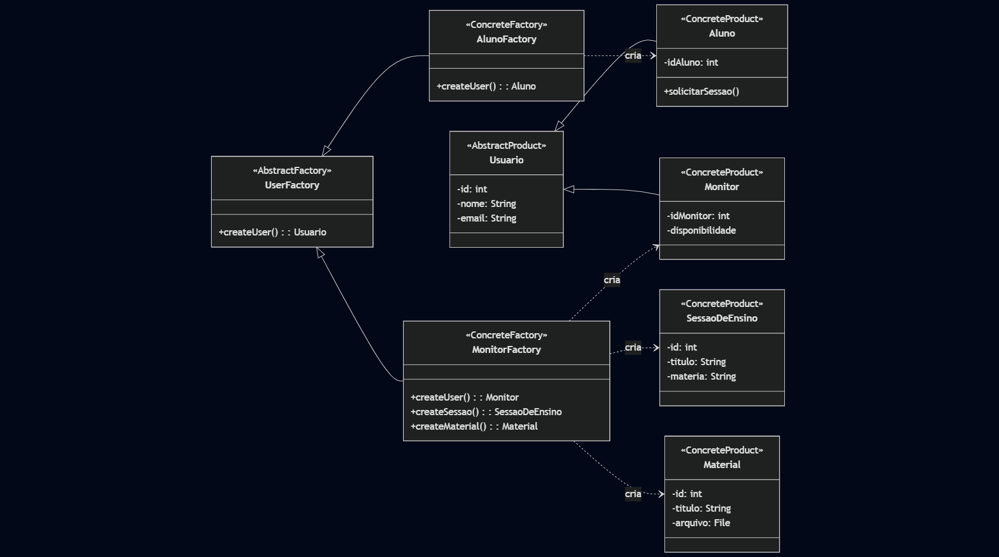

# GoF Criacional – Abstract Factory


## Introdução

O Abstract Factory (Fábrica Abstrata) é um dos 23 padrões de projeto "Gang of Four" (GoF) e se enquadra na categoria de padrões criacionais.

O objetivo principal desse padrão é fornecer uma interface para criar famílias de objetos relacionados ou dependentes sem ter que especificar suas classes concretas.

## Metodologia

Para a aplicação do padrão no projeto da plataforma de monitoria, foram adotadas as seguintes etapas metodológicas:

1.  Inicialmente, foi analisado o diagrama de classes (UML), que serviu como base estrutural para identificar as entidades, seus relacionamentos e as possíveis abstrações necessárias.
2.  Foi identificado que o sistema lida com diferentes tipos de usuários (Aluno, Monitor) que, por sua vez, criam e interagem com diferentes famílias de objetos (SessaoDeEnsino, Material).
3.  O padrão Abstract Factory foi selecionado por ser ideal para gerenciar a criação desses objetos de forma controlada, garantindo que cada tipo de usuário só possa criar os "produtos" (entidades) que lhes são permitidos.
4.  A modelagem da solução foi realizada gerando um novo diagrama de classes (em código Mermaid) para visualizar a aplicação do padrão, e exemplos de código em TypeScript, seguindo a estrutura do exemplo fornecido.

## Diagrama do GoF Abstract Factory

font size="2"><p style="text-align: center"><b>Figura 1:</b> Diagrama Criacional Abstract Factory.</p></font>

<div style="text-align: center;"> 



<font size="2"><p style="text-align: center"><b>Autores:</b> João Moreira, Pedro Camilo, 2025.</p></font>
</div>

## Código

Abaixo se encontra o código implementado em TypeScript (com a estrutura do Nest.js, como no seu exemplo) para implementar essa solução.

### Modelos (Stubs) Estes arquivos representam suas classes do diagrama.

```typescript
export abstract class Usuario {
  constructor(
    public id: number,
    public nome: String,
    public email: String,
    public senha: String
  ) {}
}

import { Usuario } from "./usuario.model";
export class Aluno extends Usuario {
  constructor(
    id: number,
    nome: String,
    email: String,
    senha: String,
    public idAluno: number
  ) {
    super(id, nome, email, senha);
  }
}

import { Usuario } from "./usuario.model";
export class Monitor extends Usuario {
  constructor(
    id: number,
    nome: String,
    email: String,
    senha: String,
    public idMonitor: number,
    public disponibilidade: any
  ) {
    super(id, nome, email, senha);
  }
}

export class SessaoDeEnsino {
  constructor(
    public id: number,
    public titulo: String,
    public materia: String,
    public data: Date,
    public horario: String
  ) {}
}

export class Material {
  constructor(
    public id: number,
    public titulo: String,
    public materia: String,
    public arquivo: String, 
    public dataEnvio: Date
  ) {}
}
```

### Fábricas

**user.factory.interface.ts**

```typescript
import { Usuario } from "../shared/models/usuario.model";

export abstract class UserFactory {
  abstract createUser(): Usuario;
}
```

**aluno.factory.service.ts**

```typescript
import { Injectable } from "@nestjs/common";
import { Aluno } from "../shared/models/aluno.model";
import { UserFactory } from "./user.factory.interface";

@Injectable()
export class AlunoFactory implements UserFactory {
  createUser(): Aluno {
    return new Aluno(
      1,
      "João Aluno",
      "joao.aluno@example.com",
      "senhaAluno123",
      101
    );
  }
}
```

**monitor.factory.service.ts**

```typescript
import { Injectable } from "@nestjs/common";
import { Material } from "../shared/models/material.model";
import { Monitor } from "../shared/models/monitor.model";
import { SessaoDeEnsino } from "../shared/models/sessao-de-ensino.model";
import { UserFactory } from "./user.factory.interface";

@Injectable()
export class MonitorFactory implements UserFactory {
  createUser(): Monitor {
    return new Monitor(
      2,
      "Maria Monitora",
      "maria.monitora@example.com",
      "senhaMonitorForte456",
      202,
      { dias: ["seg", "qua"], horario: "14h-16h" } 
    );
  }

  createSessao(): SessaoDeEnsino {
    return new SessaoDeEnsino(
      501,
      "Aula de Cálculo I",
      "Cálculo",
      new Date(),
      "15:00"
    );
  }

  createMaterial(): Material {
    return new Material(
      701,
      "Lista de Exercícios - Limites",
      "Cálculo",
      "/uploads/lista_limites.pdf",
      new Date()
    );
  }
}
```

## Código

A aplicação do padrão Abstract Factory no projeto da Plataforma de Monitoria foi eficaz para organizar e desacoplar a criação dos diferentes tipos de usuários (Aluno e Monitor) e os objetos que cada um pode produzir (SessaoDeEnsino, Material).

O padrão trouxe uma estrutura clara, facilitou a separação de responsabilidades e tornou o sistema mais extensível. Caso um novo tipo de usuário (ex: "Professor Coordenador") seja adicionado, bastaria criar uma nova fábrica concreta, sem a necessidade de alterar o código cliente que consome essas fábricas.

## Histórico de Versões

| Versão | Data | Descrição | Autor(es) | Revisor(es) |
| :--- | :--- | :--- | :--- | :--- |
| 1.0 | 22/10/2025 | Criação da documentação do padrão Abstract Factory. | Joao Moreira & Pedro Camilo | Maria Eduarda Araujo Pereira |

