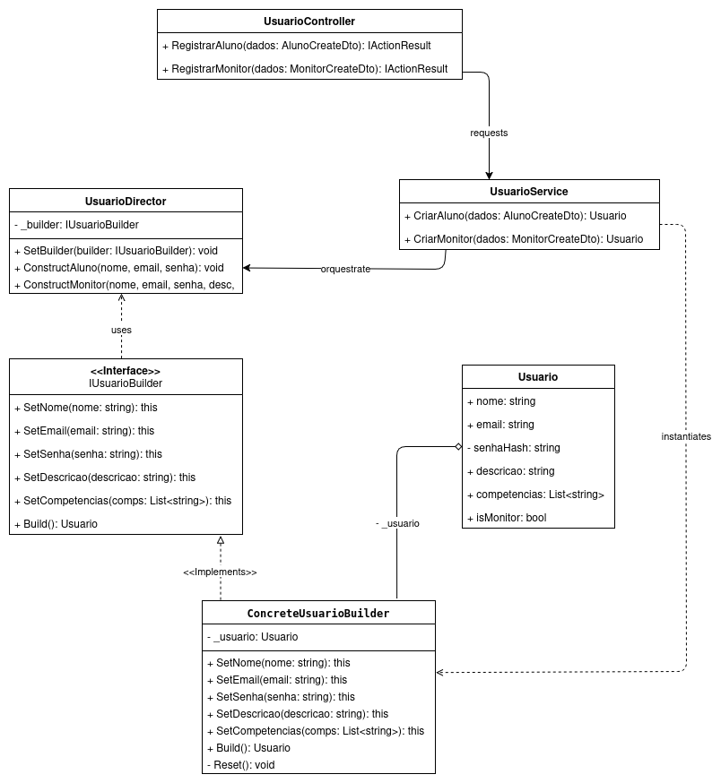

# GoF Criacional – Builder


## Introdução

O padrão GoF Builder é um padrão de projeto criacional que permite a construção de objetos complexos passo a passo. Ele é projetado para separar a lógica de construção de um objeto de sua representação final, permitindo que o mesmo processo de construção crie diferentes variações desse objeto.

No projeto MonitorOn, o padrão foi aplicado na criação da entidade `Usuario`. Esta classe é um candidato ideal, pois sua criação é complexa e baseada no Caso de Uso [UC1 - Realizar Cadastro:](https://unbarqdsw2025-2-turma01.github.io/2025.2-T01-G8_Sei-PossoEnsinar_Entrega_02/#/Modelagem/2.3.1.ModelagemCasosDeUso?id=uc1-realizar-cadastro)

1.  Um `Usuário` possui dados obrigatórios (nome, e-mail, senha).
2.  Um `Usuário` pode ter dados opcionais (descrição).
3.  A lógica de cadastro pode criar diferentes representações, como um `Aluno` (construção básica) ou um `Monitor` (construção completa, com `competências`).

O Builder entra como uma ferramenta para gerenciar essa complexidade de forma limpa e escalável.

## Metodologia

1.  **Análise dos Requisitos e Diagramas**

      * Analisamos o **UC1 - Realizar Cadastro**, que identifica a necessidade de criar um `Usuário` com um fluxo principal (obrigatório) e um fluxo alternativo (opcional, com competências).
      * Escolhemos a classe `Usuario` como o "Produto" do padrão.

2.  **Modelagem do Padrão (GoF Clássico)**

      * Modelamos a estrutura clássica do Builder, que inclui um `Director` para orquestrar a construção.
      * Criamos a interface `IUsuarioBuilder` para definir os passos de construção (ex: `SetNome`, `SetCompetencias`).
      * Criamos a classe `ConcreteUsuarioBuilder` para implementar as regras de negócio (ex: "hashear" a senha, definir `isMonitor`).
      * Criamos a classe `UsuarioDirector` para encapsular as "receitas" de construção (`ConstructAluno` e `ConstructMonitor`).

3.  **Implementação em C\# (.NET)**

      * Implementamos o padrão na arquitetura de camadas do sistema.
      * O `UsuarioController` recebe a requisição HTTP.
      * O `UsuarioService` orquestra o padrão, instanciando o `Builder` e o `Director` para criar o `Usuario`.


-----

## Diagrama do GoF Builder

<font size="2"><p style="text-align: center"><b>Figura 1:</b> Diagrama Criacional Builder.</p></font>

<div style="text-align: center;">



<font size="2"><p style="text-align: center"><b>Autor:</b> Atyrson Souto, 2025.</p></font>
</div>


## Código

Abaixo se encontra o código implementado em C#, separado por sessões para facilitar a leitura.

### Model (Entidade)
- Esta é a classe "Produto" que será construída.
- `Usuario.cs`
```
using System.Collections.Generic;

namespace SeiPossoEnsinar.Domain.Entities
{
    public class Usuario
    {
        public string Nome { get; set; }
        public string Email { get; set; }
        public string Descricao { get; set; }
        public List<string> Competencias { get; set; }
        public bool IsMonitor { get; set; }

        private string SenhaHash { get; set; }

        public void SetSenha(string hash)
        {
            this.SenhaHash = hash;
        }

        public Usuario()
        {
            Competencias = new List<string>();
            IsMonitor = false;
        }
    }
}
```

### Padrão Builder (Interfaces e Implementações)
- Estes arquivos definem o padrão Builder em si.

- `IUsuarioBuilder.cs` (Interface)

```
using SeiPossoEnsinar.Domain.Entities;
using System.Collections.Generic;

namespace SeiPossoEnsinar.Application.Builders
{
    public interface IUsuarioBuilder
    {
        IUsuarioBuilder SetNome(string nome);
        IUsuarioBuilder SetEmail(string email);
        IUsuarioBuilder SetSenha(string senha);
        IUsuarioBuilder SetDescricao(string descricao);
        IUsuarioBuilder SetCompetencias(List<string> competencias);
        Usuario Build();
    }
}
```

- `ConcreteUsuarioBuilder.cs` (Implementação)

```
using SeiPossoEnsinar.Domain.Entities;
using System.Collections.Generic;
using System;

namespace SeiPossoEnsinar.Application.Builders
{
    public class ConcreteUsuarioBuilder : IUsuarioBuilder
    {
        private Usuario _usuario;

        public ConcreteUsuarioBuilder()
        {
            this.Reset();
        }

        public void Reset()
        {
            this._usuario = new Usuario();
        }

        // Métodos fluentes (retornam 'this')
        public IUsuarioBuilder SetNome(string nome)
        {
            _usuario.Nome = nome;
            return this;
        }

        public IUsuarioBuilder SetEmail(string email)
        {
            _usuario.Email = email; // Adicionar validação de e-mail aqui
            return this;
        }

        public IUsuarioBuilder SetSenha(string senha)
        {
            string hashSimulado = $"hashed_{senha}_simulado";
            _usuario.SetSenha(hashSimulado);
            return this;
        }

        public IUsuarioBuilder SetDescricao(string descricao)
        {
            _usuario.Descricao = descricao;
            return this;
        }

        public IUsuarioBuilder SetCompetencias(List<string> competencias)
        {
            _usuario.Competencias = competencias;

            if (competencias != null && competencias.Count > 0)
            {
                _usuario.IsMonitor = true;
            }
            return this;
        }

        public Usuario Build()
        {
            Usuario produtoFinal = this._usuario;
            this.Reset();
            return produtoFinal;
        }
    }
}
```

- `UsuarioDirector.cs` (Diretor)

```
using System.Collections.Generic;

namespace SeiPossoEnsinar.Application.Builders
{
    public class UsuarioDirector
    {
        private IUsuarioBuilder _builder;

        public void SetBuilder(IUsuarioBuilder builder)
        {
            this._builder = builder;
        }

        // Receita 1: (UC1 - Fluxo Principal)
        public void ConstructAluno(string nome, string email, string senha)
        {
            _builder.SetNome(nome)
                    .SetEmail(email)
                    .SetSenha(senha);
        }

        // Receita 2: (UC1 - Fluxo Alternativo)
        public void ConstructMonitor(string nome, string email, string senha, string descricao, List<string> competencias)
        {
            this.ConstructAluno(nome, email, senha);

            _builder.SetDescricao(descricao)
                    .SetCompetencias(competencias);
        }
    }
}
```

### Camadas da Aplicação (Controller e Service)
- Estes arquivos mostram como a arquitetura em camadas consome o padrão Builder.

- `UsuarioService.cs` (Camada de Serviço)

```
using SeiPossoEnsinar.Domain.Entities;
using SeiPossoEnsinar.Application.Builders;
using SeiPossoEnsinar.Application.Dtos;

namespace SeiPossoEnsinar.Application.Services
{
    public class UsuarioService
    {
        private readonly ConcreteUsuarioBuilder _builder;
        private readonly UsuarioDirector _director;

        public UsuarioService()
        {
            _builder = new ConcreteUsuarioBuilder();
            _director = new UsuarioDirector();
            // Injeta o builder no director
            _director.SetBuilder(_builder);
        }

        // Método para o UC1 - Fluxo Principal
        public Usuario CriarAluno(AlunoCreateDto dados)
        {
            _director.ConstructAluno(dados.Nome, dados.Email, dados.Senha);

            return _builder.Build();
        }

        // Método para o UC1 - Fluxo Alternativo
        public Usuario CriarMonitor(MonitorCreateDto dados)
        {
            _director.ConstructMonitor(
                dados.Nome,
                dados.Email,
                dados.Senha,
                dados.Descricao,
                dados.Competencias
            );

            return _builder.Build();
        }
    }

    namespace SeiPossoEnsinar.Application.Dtos
    {
        public class AlunoCreateDto
        {
            public string Nome { get; set; }
            public string Email { get; set; }
            public string Senha { get; set; }
        }

        public class MonitorCreateDto : AlunoCreateDto
        {
            public string Descricao { get; set; }
            public List<string> Competencias { get; set; }
        }
    }
}
```

- `UsuarioController.cs` (Camada de API)

```
using Microsoft.AspNetCore.Mvc;
using SeiPossoEnsinar.Application.Services;
using SeiPossoEnsinar.Application.Dtos;
using SeiPossoEnsinar.Domain.Entities;

namespace SeiPossoEnsinar.Api.Controllers
{
    [ApiController]
    [Route("api/[controller]")]
    public class UsuarioController : ControllerBase
    {
        private readonly UsuarioService _usuarioService;

        public UsuarioController(UsuarioService usuarioService)
        {
            _usuarioService = usuarioService;
        }

        [HttpPost("registrar-aluno")]
        public IActionResult RegistrarAluno([FromBody] AlunoCreateDto dados)
        {
            Usuario novoAluno = _usuarioService.CriarAluno(dados);
            return CreatedAtAction(nameof(RegistrarAluno), novoAluno);
        }

        [HttpPost("registrar-monitor")]
        public IActionResult RegistrarMonitor([FromBody] MonitorCreateDto dados)
        {
            Usuario novoMonitor = _usuarioService.CriarMonitor(dados);
            return CreatedAtAction(nameof(RegistrarMonitor), novoMonitor);
        }
    }
}
```

#### Informações adicionais

- [Código rodando](https://drive.google.com/file/d/1KE2oCYvQox0f16YhKX6QQob4GTeqrIJd/view?usp=sharing)<br>
  Participantes: Atyrson Souto
- [Repositório do Código](https://github.com/UnBArqDsw2025-2-Turma01/2025.2-T01-G8_Sei-PossoEnsinar_Entrega_03/tree/745de191061894a49ff90b42afbaab1acfac0459/docs/Projeto/State/SeiPossoEnsinar)

### Conclusão
O padrão Builder provou ser uma solução excelente para o problema de criação de usuários no Sei&PossoEnsinar. Ele não apenas simplificou a criação de um objeto complexo com múltiplas variações (Aluno vs. Monitor), mas também fortaleceu nossa arquitetura, alinhando-se aos princípios SOLID e promovendo um design limpo e de fácil manutenção.

## Bibliografia
> Builder - Padrão Criacional. Refactoring Guru. Disponível em: https://refactoring.guru/pt-br/design-patterns/builder. Acesso em: 24 de maio. de 2025.

> GoF Design Patterns - with examples using Java and UML2. Benneth Christiansson (Ed.), Mattias Forss, Ivar Hagen, Kent Hansson, Johan Jonasson, Mattias Jonasson, Fredrik Lott, Sara Olsson e Thomas Rosevall. Disponível em: [https://edeleastar-portfolio.github.io/design-patterns-with-enterprise-arch/topic00-catalogues/talk-4/GoF_DesignPatterns_Java_UML.pdf ](https://edeleastar-portfolio.github.io/design-patterns-with-enterprise-arch/topic00-catalogues/talk-4/GoF_DesignPatterns_Java_UML.pdf ). Acesso em: 24 de maio de 2025.


## Histórico de Versões

| Versão | Data | Descrição | Autor(es) | Revisor(es) |
| :--- | :--- | :--- | :--- | :--- |
| 1.0 | 22/10/2025 | Criação da documentação do padrão Builder para a classe `Usuario`. | Atyrson Souto | Yan Guimarães |
| 1.1 | 22/10/2025 | Adiciona sessões de Introdução e Metodologias  | Atyrson Souto | Yan Guimarães |
| 1.2 | 24/10/2025 | 	Adição dos códigos em C# | Yan Guimarães |  |
