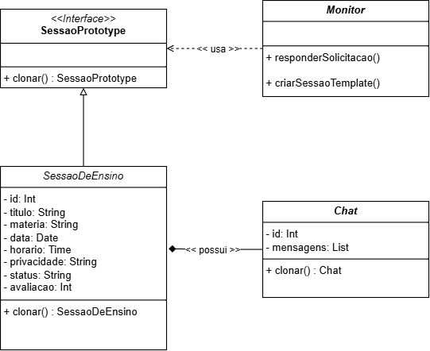

# 3.1.5. Prototype

## Introdução

Este documento detalha a implementação do padrão de projeto Prototype em um sistema voltado para o gerenciamento e agendamento de sessões de ensino, onde a rápida replicação de configurações é um requisito de eficiência.

O padrão Prototype, um dos padrões Criacionais definidos pelo Gang of Four (GoF), tem como princípio fundamental permitir a criação de novos objetos por meio da clonagem de uma instância existente (o protótipo), em vez de instanciá-los a partir do zero. Essa técnica é crucial para mitigar o acoplamento do código cliente às classes concretas e otimizar a performance, especialmente quando a inicialização de um objeto é um processo custoso em termos de recursos ou complexo em termos de lógica.

No contexto deste projeto de sistema de sessões, a adoção do Prototype visa estabelecer uma fundação didática sólida, permitindo a demonstração prática da sua utilidade na clonagem de configurações de sessões e estruturas de comunicação associadas.

-----

## Metodologia

O processo de aplicação do padrão Prototype seguiu as seguintes etapas estruturadas:

1. Estudo Teórico: Revisão aprofundada da documentação e exemplos do padrão Prototype, focando na sua estrutura(Interface Protótipo, Protótipo Concreto e Cliente).
2. Mapeamento de Requisitos: Análise do diagrama de classes existente para identificar os componentes mais adequados para serem definidos como protótipos, que no cenário de ensino seriam as entidades SessaoDeEnsino e Chat.
3. Modelagem UML: Definição da interface SessaoPrototype e adaptação das classes concretas (SessaoDeEnsino e Chat) para implementar o método de clonagem, formalizando as relações de dependência (<< usa >>) e herança (generalização/realização), conforme ilustrado no diagrama fornecido.
4. Definição do Cliente: Designação da classe Monitor como o ator (Cliente) que orquestra a criação de novas sessões e chats através da interface de protótipo.
5. Elaboração do diagrama: o diagrama feito na plataforma draw.io.

-----

## Desenvolvimento

Conforme descrito na metodologia, a aplicação do padrão GoF Prototype foi direcionada para otimizar a criação de novas sessões de ensino e seus respectivos ambientes de chat, um processo que se beneficia da reutilização de configurações. O cenário adaptado para o desenvolvimento da atividade foca na rotina do Monitor ao agendar um conjunto de sessões didáticas.

Imagine que o Monitor precisa criar uma série de SessaoDeEnsino para um minicurso de "Programação Orientada a Objetos", que será repetido em três datas diferentes (segunda, quarta e sexta-feira), mantendo o mesmo conteúdo (titulo, materia) e configurações de privacidade.

**Em um modelo tradicional, o Monitor teria que executar o seguinte processo repetidamente, usando o operador new:**

1. Instanciar a SessaoDeEnsino para a segunda-feira.
2. Setar todos os atributos (título, matéria, etc.).
3. Instanciar um novo Chat e associá-lo à sessão.
4. Repetir os passos 1 a 3 para a quarta-feira e sexta-feira.

**Com o Padrão Prototype, o processo é simplificado:**

1. Uma SessaoDeEnsino modelo (o protótipo) é configurada uma única vez com todos os atributos comuns.
2. O Monitor (Cliente) obtém esse protótipo.
3. Para cada nova sessão (quarta e sexta), o Monitor chama o método clonar() do protótipo.
4. O Monitor altera apenas os atributos variantes da nova instância clonada (ex: data e horario).

Essa otimização reduz a carga de inicialização e o acoplamento do código de criação no Cliente.

-----

### Diagrama

<font size="2"><p style="text-align: center"><b>Figura 1: </b>Diagrama de Classes para implementação do padrão Prototype</p></font>

<div style="text-align: center;">



</div>

<font size="2"><p style="text-align: center"><b>Autor:</b> <a href="https://github.com/leanars">Bruno Cruz e Anne de Capdeville</a>, 2025</p></font>


O diagrama de classes reflete fielmente a estrutura do padrão Prototype e suas interações no sistema:
1. **Interface do Protótipo (Prototype):**
    - Elemento: <<Interface>> SessaoPrototype
    - Função: Atua como o contrato universal para qualquer objeto que possa ser clonado.
    - Método Chave: + clonar() : SessaoPrototype

Este método garante que o Cliente (Monitor) possa solicitar uma cópia sem saber se está lidando com uma SessaoDeEnsino ou qualquer outra futura classe que implemente esta interface.

2. **Protótipos Concretos (Concrete Prototypes):**
    - Elemento: SessaoDeEnsino (Implementa SessaoPrototype)
        - Esta classe concreta define a estrutura de dados complexa a ser copiada (atributos como titulo: String, materia: String, privacidade: String, avaliacao: Int).
        - A implementação de clonar() nesta classe deve orquestrar a cópia de seus atributos.
    - Elemento: Chat (Também implementa SessaoPrototype)
        - O Chat é uma estrutura de dados de referência, contendo mensagens: List.
        - A relação de composição/agregação (<>- possui -) com SessaoDeEnsino exige que a sua clonagem seja independente. Se o Chat não fosse clonado, ao alterar as mensagens na sessão clonada, as mensagens também seriam alteradas na sessão protótipo, o que é inaceitável.
        - Implementação clonar() em Chat: Deve criar uma nova instância de Chat e copiar o conteúdo da lista de mensagens (ou iniciá-la vazia), e não apenas a referência para a lista, garantindo a independência entre as sessões.

3. **Cliente (Client)**
    - Elemento: Monitor
    - Função: É o ator que demanda a criação dos objetos.
    - Interação Chave: A dependência (<< usa >>) do Monitor para a SessaoPrototype significa que a lógica dentro de responderSolicitação() ou criarSessaoTemplate() irá:
        1. Obter uma instância do protótipo.
        2. Chamar prototipo.clonar().
        3. Receber o novo objeto, totalmente inicializado, para uso.

-----

### Código

#### SessaoPrototype

```
public interface SessaoPrototype {
    SessaoPrototype clonar();
}

```

#### Mensagem

```
public class Mensagem {
    private String conteudo;

    public Mensagem(String conteudo) {
        this.conteudo = conteudo;
    }

    public String getConteudo() {
        return conteudo;
    }
}

```

#### Monitor

```

import java.util.Date;

public class Monitor {

    private final SessaoDeEnsino prototipoPadrao;

    public Monitor(int monitorId) {
        this.prototipoPadrao = new SessaoDeEnsino(
                999, // ID do Template
                "Minicurso de Programação Orientada a Objetos (POO)",
                "Arquitetura de Software",
                "20:00",
                "Publica"
        );
        System.out.println("\n[Monitor " + monitorId + "] PROTÓTIPO BASE (Minicurso POO) CRIADO: " + prototipoPadrao.getTitulo());
    }

    public SessaoDeEnsino criarSessao(Date dataAgendada) {
        SessaoDeEnsino novaSessao = prototipoPadrao.clonar();
        novaSessao.setData(dataAgendada);
        return novaSessao;
    }
}
```

#### Chat

```

import java.util.ArrayList;
import java.util.List;

public class Chat {
    private static int PROXIMO_ID_CHAT = 1000;
    private int id;
    private List<Mensagem> mensagens;

    public Chat(int idBase) {
        if (idBase == 0) {
            this.id = ++PROXIMO_ID_CHAT;
        } else {
            this.id = idBase;
        }
        this.mensagens = new ArrayList<>();
    }

    public Chat(Chat origem) {
        this.id = ++PROXIMO_ID_CHAT;
        this.mensagens = new ArrayList<>();
    }

    public Chat clonar() {
        return new Chat(this);
    }

    public int getId() {
        return id;
    }

    public List<Mensagem> getMensagens() {
        return mensagens;
    }

    public void enviarMensagem(String conteudo) {
        Mensagem novaMensagem = new Mensagem(conteudo);
        this.mensagens.add(novaMensagem);
        System.out.println("   [Chat " + id + "] Enviado: \"" + conteudo + "\"");
    }

    public List<Mensagem> receberMensagem() {
        return new ArrayList<>(this.mensagens);
    }
}
```

#### SessaoDeEnsino

```

import java.util.Date;
import java.util.Random;

public class SessaoDeEnsino implements SessaoPrototype {

    private int id;
    private String titulo;
    private String materia;
    private Date data;
    private String horario;
    private String privacidade;
    private String status;
    private int avaliacao;

    private Chat chat;

    public SessaoDeEnsino(int id, String titulo, String materia, String horario, String privacidade) {
        this.id = id;
        this.titulo = titulo;
        this.materia = materia;
        this.horario = horario;
        this.privacidade = privacidade;
        this.status = "TEMPLATE_PROTOTIPO";
        this.avaliacao = 0;
        this.chat = new Chat(id * 10);
    }

    private SessaoDeEnsino(SessaoDeEnsino origem) {
        this.id = new Random().nextInt(1000) + 1;
        this.titulo = origem.titulo;
        this.materia = origem.materia;
        this.horario = origem.horario;
        this.privacidade = origem.privacidade;
        this.avaliacao = 0;
        this.data = null;
        this.status = "AGENDADA";
        this.chat = origem.chat.clonar();

        System.out.println("Sessao " + this.id + " clonada. Novo Chat ID: " + this.chat.getId());
    }

    @Override
    public SessaoDeEnsino clonar() {
        return new SessaoDeEnsino(this);
    }

    public void setData(Date data) {
        this.data = data;
    }

    public void setTitulo(String titulo) {
        this.titulo = titulo;
    }

    public String getTitulo() {
        return titulo;
    }

    public String getStatus() {
        return status;
    }

    public Chat getChat() {
        return chat;
    }

    @Override
    public String toString() {
        return "Sessao ID: " + id +
                " | Titulo: " + titulo +
                " | Data: " + (data != null ? data.toString() : "N/A") +
                " | Status: " + status;
    }
}
```

#### Aplicacao (Main)

```

import java.util.Calendar;
import java.util.Date;
import java.text.SimpleDateFormat;
import java.util.List;

public class Aplicacao {
    private static final SimpleDateFormat DATE_FORMAT = new SimpleDateFormat("dd/MM/yyyy");

    private static Date criarData(int dia) {
        Calendar cal = Calendar.getInstance();
        cal.set(2025, Calendar.OCTOBER, dia);
        return cal.getTime();
    }

    public static void main(String[] args) {
        System.out.println("==============================================");
        System.out.println("--- DEMONSTRAÇAO DO PROTOTYPE ---");
        System.out.println("==============================================");

        Monitor monitor = new Monitor(10);

        System.out.println("\n--- 1. CRIANDO SESSOES POR CLONAGEM RAPIDA ---");

        Date data1 = criarData(28);
        SessaoDeEnsino s1 = monitor.criarSessao(data1);

        Date data2 = criarData(4);
        SessaoDeEnsino s2 = monitor.criarSessao(data2);

        Date data3 = criarData(11);
        SessaoDeEnsino s3 = monitor.criarSessao(data3);
        s3.setTitulo("Monitoria GoF: Prototype");

        System.out.println("\n--- RESULTADOS DAS COPIAS ---");
        System.out.println("Sessao 1: " + s1.toString());
        System.out.println("Sessao 3 (Titulo alterado): " + s3);

        System.out.println("\n--- 2. TESTE DE INDEPENDENCIA NO CHAT ---");

        s1.getChat().enviarMensagem("Aluno: Ola, podemos revisar o UML?");
        s1.getChat().enviarMensagem("Monitor: Claro! Comecando agora.");

        s3.getChat().enviarMensagem("Aluno: Mensagem exclusiva da sessao 3.");

        System.out.println("\n--- VERIFICAÇAO DE DADOS ---");

        List<Mensagem> mensagensS1 = s1.getChat().receberMensagem();
        System.out.println("S1 (Data " + DATE_FORMAT.format(data1) + ") - Qtde de mensagens: " + mensagensS1.size());

        List<Mensagem> mensagensS2 = s2.getChat().receberMensagem();
        System.out.println("S2 (Data " + DATE_FORMAT.format(data2) + ") - Qtde de mensagens: " + mensagensS2.size());

        List<Mensagem> mensagensS3 = s3.getChat().receberMensagem();
        System.out.println("S3 (Data " + DATE_FORMAT.format(data3) + ") - Qtde de mensagens: " + mensagensS3.size());

        if (mensagensS2.isEmpty() && !mensagensS1.isEmpty()) {
            System.out.println("\nSucesso");
            System.out.println("O clone S2 nao compartilhou o historico de mensagens do S1, confirmando a independencia no Chat.");
        } else {
            System.out.println("\nFalha. Teste de independencia falhou.");
        }
    }
}
```


-----

## Histórico de Versões

| Versão | Data       | Descrição                          | Autor(es)                       | Revisor(es)        |
| :----- | :--------- | :--------------------------------- | :------------------------------ | :----------------- |
| 1.0    | 24/10/2025 | Criação da documentação            | Anne de Capdeville              | Bruno Cruz         |
| 1.1    | 24/10/2025 | Documentação e criação do diagrama | Anne de Capdeville e Bruno Cruz | Bruno Cruz         |
| 1.2    | 24/10/2025 | Adição dos códigos                 | Anne de Capdeville e Bruno Cruz | Anne de Capdeville |


