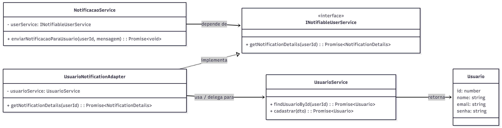

# GoF Estrutural – Adapter

## Introdução

Este documento apresenta o padrão de projeto estrutural **Adapter**, conforme descrito pelo **Gang of Four (GoF)**, e sua aplicação prática em um sistema de gerenciamento de monitorias (**Sei&PossoEnsinar / MonitorOn**) construído com **NestJS** e **PostgreSQL**.

O padrão **Adapter** tem como objetivo permitir a colaboração entre classes com **interfaces incompatíveis**, sem que seja necessário alterar o código existente. Ele atua como um *“tradutor”*, possibilitando o **reaproveitamento de código** e a **integração entre módulos**, como um novo serviço de notificações e o seu serviço de usuários já existente.

---

##  Metodologia

A construção deste trabalho seguiu os seguintes passos:

1. **Análise do cenário real do projeto:**  
   Um serviço de usuários (`UsuarioService`), baseado na sua classe `Usuario`, já implementado com métodos como `cadastrar`, `realizarLogin`, `gerenciarPerfil` e `findUsuarioById`.

2. **Identificação da necessidade de adaptação:**  
   Um novo módulo de notificações (`NotificacaoService`) precisa obter dados básicos do usuário (nome e e-mail) para enviar alertas, mas ele não deve conhecer toda a complexidade do `UsuarioService`.

3. **Criação da interface esperada pelo módulo:**  
   `INotifiableUserService`.

4. **Criação de um adaptador:**  
   `UsuarioNotificationAdapter`, que implementa a interface `INotifiableUserService`, mas delega as chamadas ao `UsuarioService`.

5. **Validação:**  
   Demonstração do código funcional dentro do ambiente **NestJS**.

---

## Desenvolvimento

No sistema de monitoria, o `NotificacaoService` é responsável por enviar **e-mails** ou **alertas** (por exemplo, sobre uma `SessaoDeEnsino` agendada).  
Para isso, ele precisa do **nome** e **e-mail** do `Aluno` ou `Monitor`.

No entanto, o `UsuarioService` (que gerencia `Aluno` e `Monitor`, pois ambos são, em essência, `Usuarios`) expõe muitos métodos que não interessam ao `NotificacaoService`.  
Usamos o padrão **Adapter** para **desacoplar** esses módulos.

Abaixo estão os códigos que demonstram a aplicação:

1. **Interface esperada pelo Módulo de Notificação (`NotifiableUserService.ts`)**  
   Esta é a *interface alvo* (*Target*) que o `NotificacaoService` espera.

   ```typescript
   export const NOTIFIABLE_USER_SERVICE = 'INotifiableUserService';

    export interface NotifiableUserService {
    getNotificationDetails(userId: number): Promise<{ nome: string; email: string }>;
    }
    ```

2. **Serviço Original (`usuario.service.ts`)**  
   Este é o *serviço existente* (*Adaptee*). Ele possui a lógica de negócio completa para gerenciar um `Usuario`.

   ```typescript
   import { Injectable, NotFoundException } from '@nestjs/common';

    export interface Usuario {
    id: number;
    nome: string;
    email: string;
    senha: string;
    }

    @Injectable()
    export class UsuarioService {
    private readonly usuarios: Usuario[] = [
        { id: 1, nome: 'João Victor', email: 'joaovictor@gmail.com', senha: '123' },
        { id: 2, nome: 'Aluno Teste', email: 'aluno@gmail.com', senha: '456' },
    ];

    constructor() {
        console.log('LOG: UsuarioService (o serviço ORIGINAL) foi inicializado.');
    }


    async findUsuarioById(userId: number): Promise<Usuario> {
        console.log(`LOG: [UsuarioService] Buscando usuário COMPLETO com ID: ${userId}`);
        const usuario = this.usuarios.find(u => u.id === userId);
        if (!usuario) {
        throw new NotFoundException(`Usuário com ID ${userId} não encontrado.`);
        }
        return usuario;
    }

    async cadastrar(dto: any): Promise<Usuario> {
        console.log('LOG: [UsuarioService] Método complexo de CADASTRO chamado.');
        return this.usuarios[0];
    }
    }
    ```

3. **Adaptador (`usuario-notification.adapter.ts`)**  
   Este é o *Adapter*. Ele implementa a interface `NotifiableUserService` e, internamente, “traduz” a chamada para o `UsuarioService`.

   ```typescript
   import { Injectable, NotFoundException } from '@nestjs/common';
    import { NotifiableUserService } from './interfaces/INotifiableUserService.interface';
    import { UsuarioService } from './usuario.service';

    @Injectable()
    export class UsuarioNotificationAdapter implements NotifiableUserService {
    constructor(
        private readonly usuarioService: UsuarioService
    ) {
        console.log('LOG: UsuarioNotificationAdapter (o TRADUTOR) foi inicializado.');
    }

    async getNotificationDetails(
        userId: number,
    ): Promise<{ nome: string; email: string }> {
        console.log(`LOG: [Adapter] Recebeu chamada para getNotificationDetails(${userId})`);
        
        const usuarioCompleto = await this.usuarioService.findUsuarioById(userId);
        console.log(`LOG: [Adapter] Usuário completo recebido do UsuarioService.`);

        const dadosAdaptados = {
        nome: usuarioCompleto.nome,
        email: usuarioCompleto.email,
        };
        
        console.log(`LOG: [Adapter] Traduzindo para o formato simples:`, dadosAdaptados);
        return dadosAdaptados;
    }
    }
    ```

4. **Uso no Módulo de Notificação (`notificacao.service.ts`)**  
   Este é o *Client*. Note que ele depende da abstração (`NotifiableUserService`), e não da implementação concreta (`UsuarioService`).

   ```typescript
   import { Injectable, Inject } from '@nestjs/common';
    import { 
    NotifiableUserService, 
    NOTIFIABLE_USER_SERVICE 
    } from '../usuario/interfaces/INotifiableUserService.interface';

    @Injectable()
    export class NotificacaoService {
    constructor(
        @Inject(NOTIFIABLE_USER_SERVICE)
        private readonly userService: NotifiableUserService,
    ) {
        console.log('LOG: NotificacaoService (o CLIENTE) foi inicializado.');
    }

    async enviarNotificacaoParaUsuario(userId: number, mensagem: string): Promise<void> {
        console.log(`\n--- [NotificacaoService] INICIANDO TESTE para ID: ${userId} ---`);

        const userDetails = await this.userService.getNotificationDetails(
        userId,
        );

        console.log(`LOG: [NotificacaoService] Detalhes recebidos do adapter:`, userDetails);
        console.log(`LOG: [NotificacaoService] ENVIANDO EMAIL para ${userDetails.nome} (${userDetails.email}): ${mensagem}`);
        console.log(`--- [NotificacaoService] TESTE FINALIZADO ---`);
    }
    }
    ```

5. **Registro no Módulo (`notificacao.module.ts`)**  
   Finalmente, no módulo do **NestJS** (seja o `AppModule` ou um `NotificacaoModule` dedicado), registramos os *providers* para que a injeção de dependência funcione.

   ```typescript
   import { Module } from '@nestjs/common';
    import { NotificacaoService } from './notificacao.service';
    import { UsuarioModule } from '../usuario/usuario.module';

    @Module({
    imports: [
        UsuarioModule, 
    ],
    providers: [NotificacaoService],
    exports: [NotificacaoService],
    })
    export class NotificacaoModule {}
    ```


## Diagrama do GoF Adapter

    <font size="2"><p style="text-align: center"><b>Figura 1:</b> Diagrama Estrutural Adapter.</p></font>

    

    <font size="2"><p style="text-align: center"><b>Autores:</b> João Moreira, Pedro Camilo, 2025.</p></font>

    [](https://www.youtube.com/watch?v=GPMCRX6zpto)

## Histórico de Versões

| Versão | Data | Descrição | Autor(es) | Revisor(es) |
| :--- | :--- | :--- | :--- | :--- |
| 1.0 | 22/10/2025 | Criação do documento, adição da introdução, metodologia e desenvolvimento. | João Moreira e Pedro Camilo | Maria Eduarda Pereira |