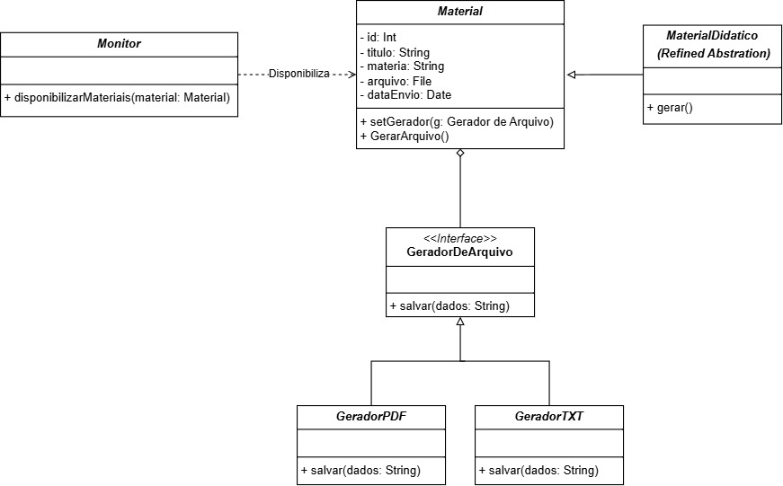

# 3.2.2 Bridge

## Introdução

O padrão Bridge (Ponte) é uma solução de design estrutural concebida para desacoplar uma abstração de sua implementação. O objetivo principal é garantir que tanto a lógica de alto nível (a abstração) quanto os detalhes operacionais de baixo nível (a implementação) possam ser desenvolvidos e modificados de forma completamente independente, sem que uma alteração em uma dimensão force modificações na outra.

Este padrão é a resposta arquitetônica para o problema da **explosão combinatória de subclasses**. Quando um sistema apresenta duas ou mais "dimensões de variação" ortogonais – por exemplo, tipos de materiais e formatos de exportação – a herança tradicional levaria à criação de uma subclasse para cada combinação possível (ex: MaterialPDF, MaterialTXT, etc.). O Bridge evita isso, estabelecendo uma relação de **Composição** entre a Abstração e a interface da Implementação, criando uma "ponte" flexível entre as duas hierarquias.

No nosso projeto, o Bridge é aplicado na funcionalidade de disponibilização de Material Didático, separando o conteúdo a ser compartilhado (a Abstração) da tecnologia de exportação (a Implementação).

**Princípios Fundamentais do Bridge:**

1. **Separação de Preocupações:** Isola o que o sistema faz (gerenciar o material) de como o sistema o faz (gerar o arquivo PDF ou TXT).
2. **Flexibilidade em Tempo de Execução:** Permite que o formato de arquivo (a implementação) associado a um Material seja alterado dinamicamente através do uso do método *setter*.
3. **Composição sobre Herança:** Utiliza a Composição para resolver o problema de acoplamento da herança.

-----

## Metodologia

O processo de aplicação do padrão Bridge seguiu uma abordagem estruturada:

1. **Fundamentação Teórica:** Estudo aprofundado do padrão Bridge, focando na distinção entre Abstração e Implementação, e a importância da Composição sobre a Herança.
2. **Modelagem UML:** Formalização da estrutura, onde a hierarquia de `Material` (Abstração) utiliza a Composição para referenciar a interface `GeradorDeArquivo` (Implementador), que é implementada pelas classes concretas `GeradorPDF` e `GeradorTXT`.
3. **Desenvolvimento:** A codificação em Java focou em garantir que a classe `Material` possua uma referência privada e protegida para o `GeradorDeArquivo`, permitindo o *setter* público para troca de implementação em tempo de execução.
4. **Validação:** Confirmação de que o mesmo objeto `Material` pode ser configurado para gerar TXT e PDF, validando a flexibilidade central do Bridge.

-----

## Desenvolvimento

O processo de implementação do padrão Bridge no módulo de gestão de materiais didáticos seguiu uma abordagem estruturada, fundamentada em princípios de design de software e validação prática. O objetivo foi garantir o desacoplamento eficiente entre a lógica de manipulação do conteúdo e o mecanismo de exportação.

A **Abstração** (`MaterialDidatico`) foi separada da **Implementação** (`GeradorDeArquivo`). O `MaterialDidatico` contém o conteúdo (o *que fazer*) e delega a operação de exportação para um objeto que implementa a interface `GeradorDeArquivo` (o *como fazer*).

O Monitor (Cliente) agora pode configurar o mesmo objeto `MaterialDidatico` para usar diferentes implementações (`GeradorPDF` ou `GeradorTXT`) em tempo de execução, alterando a implementação de forma transparente.

-----

## Diagrama

<font size="2"><p style="text-align: center"><b>Figura 1 - Diagrama Bridge</b></p></font>

<center>



</center>

<font size="2"><p style="text-align: center"><b>Autores: Anne de Capdeville e Bruno Cruz, 2025.</b></p></font>


-----

### Código

O código em Java ilustra a separação, onde o Monitor cria um material e, em seguida, o imprime usando diferentes implementações do `GeradorDeArquivo`.

#### GeradorDeArquivo

```
public interface GeradorDeArquivo {
    void salvar(String dados);
}

```
#### GeradorPDF

```
public class GeradorPDF implements GeradorDeArquivo {
    @Override
    public void salvar(String dados) {
        System.out.println("Implementador PDF: Formatando e salvando dados como PDF (simulado)...");
        System.out.println("--- PDF FORMATADO ---");
        System.out.println(dados.toUpperCase());
    }
}

```

#### GeradorTXT

```
public class GeradorTXT implements GeradorDeArquivo {
    @Override
    public void salvar(String dados) {
        System.out.println("Implementador TXT: Salvando dados como texto simples (.txt)...");
        System.out.println("\n--- CONTEUDO ---");
        System.out.println(dados);
    }
}

```

#### Monitor

```
public class Monitor {

    private final int monitorId;

    public Monitor(int monitorId) {
        this.monitorId = monitorId;
    }

    public void disponibilizarMaterialDeEstudo(int id, String titulo, String materia, GeradorDeArquivo formatoInicial) {
        System.out.println("\n[Monitor " + monitorId + "] Preparando Material de Estudo...");

        MaterialDidatico material = new MaterialDidatico(id, titulo, materia, formatoInicial);

        material.gerar();

        System.out.println("\n--- Trocando o formato em tempo de execucao (Bridge em Acao)... ---");

        GeradorDeArquivo novoFormato = (formatoInicial instanceof GeradorPDF) ? new GeradorTXT() : new GeradorPDF();

        material.setGerador(novoFormato);
        material.gerar();
    }
}

```

#### Material

```
import java.io.File;
import java.util.Date;

public abstract class Material {

    protected int id;
    protected String titulo;
    protected String materia;
    protected File arquivo;
    protected Date dataEnvio;

    // Ponte/Bridge para o Implementor
    protected GeradorDeArquivo implementor;

    public Material(int id, String titulo, String materia, GeradorDeArquivo implementor) {
        this.id = id;
        this.titulo = titulo;
        this.materia = materia;
        this.dataEnvio = new Date();
        this.arquivo = new File(titulo.replace(" ", "_") + ".tmp");

        this.implementor = implementor;
    }

    public void setGerador(GeradorDeArquivo implementor) {
        this.implementor = implementor;
    }

    public abstract void gerar();

    protected String getTitulo() {
        return titulo;
    }
}

```

#### MaterialDidatico

```
public class MaterialDidatico extends Material {

    private final String conteudoEstudo;

    public MaterialDidatico(int id, String titulo, String materia, GeradorDeArquivo implementor) {
        super(id, titulo, materia, implementor);

        this.conteudoEstudo = "Material de Estudo: " + this.titulo +
                "\nMatéria: " + this.materia +
                "\n\nInstrucoes: Este material contem conceitos chave e exemplos praticos para aprofundamento. Revise o conteudo antes da próxima sessao.";
    }

    @Override
    public void gerar() {
        System.out.println("\n--- Gerando Material Didatico: " + this.titulo + " ---");

        // invoca a implementacao (salvar como TXT ou PDF)
        this.implementor.salvar(this.conteudoEstudo);
    }
}

```

#### Aplicacao (Main)

```
public class Aplicacao {

    static void main() {
        System.out.println("==============================================");
        System.out.println("--- DEMONSTRACAO DO BRIDGE (GOF) ---");
        System.out.println(" (Foco: Material Didatico e Formatos de Arquivo)");
        System.out.println("==============================================");

        Monitor monitor = new Monitor(42);

        System.out.println("\n****** CENARIO 1: Conceitos de Prototype (TXT/PDF) ******");
        GeradorDeArquivo txtImplementor = new GeradorTXT();
        monitor.disponibilizarMaterialDeEstudo(
                101,
                "Conceitos de Padroes Criacionais",
                "Arquitetura de Software",
                txtImplementor
        );

        System.out.println("\n------------------------------------------------");

        System.out.println("\n****** CENARIO 2: Guia de UML (PDF/TXT) ******");
        GeradorDeArquivo pdfImplementor = new GeradorPDF();
        monitor.disponibilizarMaterialDeEstudo(
                202,
                "Guia Rapido de Diagramas UML",
                "Analise e Projeto",
                pdfImplementor
        );

        System.out.println("\n==============================================");
        System.out.println("FIM: A lógica do Material (Conteudo) está desacoplada do Gerador de Arquivo (Formato).");
    }
}
```


-----

## Vídeo de Execução

* [Execução do Código]()

* [Repositório do Código](https://github.com/UnBArqDsw2025-2-Turma01/2025.2-T01-G8_Sei-PossoEnsinar_Entrega_03/tree/code-bridge)

-----

## Conclusão

A implementação do padrão Bridge no módulo de materiais didáticos foi fundamental para resolver o problema da explosão combinatória de classes. Ao separar a hierarquia da Abstração (MaterialDidatico) da hierarquia da Implementação (GeradorDeArquivo), foi alcançado um alto grau de desacoplamento. Isso permite que novas formas de exportação (ex: JSON, XML) sejam adicionadas ao sistema apenas com a criação de novas classes concretas do implementador, sem exigir qualquer modificação na hierarquia da abstração (o Princípio Open/Closed). O Bridge garante, portanto, a máxima flexibilidade para o crescimento futuro do sistema.

-----

## Bibliografia

> **GAMMA, Erich et al.** Design Patterns: Elements of Reusable Object-Oriented Software. Addison-Wesley, 1995 
> 
> **MILENE SERRANO.** Arquitetura e Desenho de Software - Aula GoFs Estruturais. Material didático, Universidade de Brasília (UnB), 2025
> 
> **LARMAN, Craig.** Utilizando UML e Padrões: Uma Introdução a Análise e ao Projeto Orientado a Objetos. 3ª ed. Bookman, 2007

-----


## Histórico de Versões

| Versão | Data       | Descrição                          | Autor(es)                       | Revisor(es)        |
| :----- | :--------- | :--------------------------------- | :------------------------------ | :----------------- |
| 1.0    | 24/10/2025 | Criação da documentação            | Anne de Capdeville              | Bruno Cruz         |
| 1.1    | 24/10/2025 | Documentação e criação do diagrama | Anne de Capdeville e Bruno Cruz | Bruno Cruz         |
| 1.2    | 24/10/2025 | Adição dos códigos                 | Anne de Capdeville e Bruno Cruz | Anne de Capdeville |
| 1.3    | 24/10/2025 | Adição da conclusão e bibliografia | Anne de Capdeville e Bruno Cruz | Anne de Capdeville |
