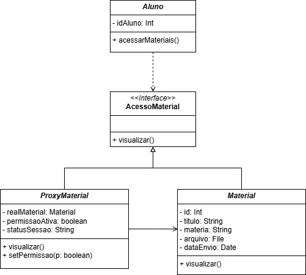

# 3.2.5. Proxy

## Introdução

Este documento detalha a aplicação do padrão de projeto Proxy no módulo de acesso a materiais didáticos do sistema, visando implementar uma camada de controle de segurança.

O padrão Proxy é classificado como um padrão Estrutural pelo Gang of Four (GoF) e é projetado para atuar como um substituto ou intermediário para um objeto real. O principal benefício é a capacidade de interceptar e gerenciar chamadas para o objeto original, permitindo a execução de lógica auxiliar, como validação de segurança, inicialização tardia de recursos, ou monitoramento, sem modificar a classe que contém a lógica de negócio principal.

No contexto deste sistema de ensino, o Proxy é utilizado como um **Proxy de Proteção**, garantindo que o acesso de um Aluno a um recurso valioso (`Material`) seja rigorosamente verificado antes da sua efetiva visualização.

-----

## Metodologia

A implementação do padrão Proxy seguiu uma metodologia focada em segurança e desacoplamento:

1. Requisito de Segurança: Identificação do requisito de que a visualização de um material (`Material`) deve ser condicionada ao status da participação do aluno (`Aluno`) na sessão de ensino associada.
2. Modelagem da Interface: Criação da interface `AcessoMaterial`, que define o contrato de visualização (`+ visualizar()`), isolando o Cliente (`Aluno`) da implementação concreta.
3. Desenho UML: Formalização da estrutura (conforme o diagrama fornecido) na notação UML, ilustrando a relação de herança e composição.
4. Implementação do Código: O `ProxyMaterial` foi construído com uma referência ao `Material` real. A chamada ao método `realMaterial.visualizar()` é feita apenas após a validação de segurança.
5. Validação Prática: Testes confirmaram que no primeiro acesso negado, o objeto `Material` real não era instanciado (Inicialização Tardia/Lazy Load), e só era criado após a concessão explícita de permissão.

-----

## Desenvolvimento

A aplicação do Proxy visa blindar o objeto `Material` contra acessos não autorizados ou fora do contexto adequado (ex: se o aluno não estiver matriculado na sessão).

### Estrutura do Proxy de Proteção

O diagrama de classes reflete a estrutura canônica do Proxy, com uma função clara para cada componente na cadeia de acesso:

| Componente (GoF) | Elemento no Código               | Função no Sistema                                                                                                                                       |
| :--------------- | :------------------------------- | :------------------------------------------------------------------------------------------------------------------------------------------------------ |
| **Subject**      | `<< interface >> AcessoMaterial` | Estabelece o contrato (`+ visualizar()`). O Aluno depende exclusivamente desta interface.                                                               |
| **Real Subject** | `Material`                       | Contém a lógica essencial de manipulação e carregamento do conteúdo (`+ visualizar()`). Classe limpa, focada apenas no conteúdo.                        |
| **Proxy**        | `ProxyMaterial`                  | Substituto inteligente. Implementa `AcessoMaterial` e possui Composição para o objeto real (`- realMaterial: Material`). Atua como filtro de segurança. |
| **Client**       | `Aluno`                          | Interage com a interface `AcessoMaterial` sem saber se está acessando o objeto real ou o `ProxyMaterial`.                                               |

### Vantagens da Implementação

* **Coesão Preservada (SRP):** A lógica complexa de verificar credenciais (`permissaoAtiva`, `statusSessao`) é confinada ao `ProxyMaterial`, mantendo a classe `Material` focada em seu conteúdo.
* **Inicialização Tardia (Lazy Load):** O `Material` real (recurso potencialmente custoso) só é instanciado na primeira tentativa de acesso que for bem-sucedida, economizando recursos.
* **Flexibilidade na Proteção:** Novas regras de segurança podem ser adicionadas ao `ProxyMaterial` sem alterar o código da classe `Material`.

-----

### Diagrama

<font size="2"><p style="text-align: center"><b>Figura 1:</b> Diagrama de Classes da aplicação do padrão Proxy</p></font>

<div style="text-align: center;">



</div>

<font size="2"><p style="text-align: center"><b>Autor:</b> <a href="https://github.com/leanars">Bruno Cruz e Anne de Capdeville</a>, 2025</p></font>

**Componentes e Fluxo de Interação (Padrão Proxy)**
O diagrama detalha os seguintes componentes e seu fluxo de interação no sistema de controle de acesso a materiais didáticos:

1. **Cliente (Client):**
    - Elemento: Aluno
    - Função: Representa a parte do sistema (o usuário) que tenta consumir o recurso. O Aluno interage com o recurso através do método + acessarMateriais(). O Aluno está desacoplado da lógica de segurança, pois ele interage apenas com a interface AcessoMaterial, sem saber se está lidando com o objeto real ou com o substituto (ProxyMaterial).

2. **Interface Comum (Subject):**
    - Elemento: <<Interface>> AcessoMaterial
    - Função: Define o contrato que o Cliente (Aluno) espera. O método principal é + visualizar(), que especifica a operação de acesso ao conteúdo. Tanto o objeto real (Material) quanto o seu representante (ProxyMaterial) implementarão esta interface, garantindo que possam ser usados de forma intercambiável pelo Aluno.

3. **Assunto Real (Real Subject):**
    - Elemento: Material
    - Função: Esta classe é a implementação concreta da interface AcessoMaterial e contém o recurso de valor e a lógica essencial de carregamento do conteúdo. Sua responsabilidade é realizar a operação de fato (+ visualizar()), que pode ser "pesada" (ex: carregar um arquivo grande). Esta classe está protegida e não contém lógica de segurança.

4. **Proxy (Proxy):**
    - Elemento: ProxyMaterial
    - Função: Esta é a peça central do padrão Proxy de Proteção. Também implementa a interface AcessoMaterial, permitindo que o Aluno interaja com ela como se fosse o Material real. O ProxyMaterial possui uma referência (- realMaterial: Material) para uma instância do Material.
    - Fluxo de Controle: O ProxyMaterial intercepta a chamada ao + visualizar() e, usando seus atributos de controle (permissaoAtiva: boolean, statusSessao: String), verifica se o Aluno possui as credenciais necessárias. Somente se as verificações passarem, ele delega a chamada ao realMaterial.


-----
### Código

O cenário de teste demonstra o bloqueio do acesso e a Inicialização Tardia do objeto real, que só é instanciado quando o acesso é permitido.

#### AcessoMaterial

```
public interface AcessoMaterial {
    void visualizar();
}

```

#### Aluno

```
public class Aluno {
    private final int idAluno;

    public Aluno(int idAluno) {
        this.idAluno = idAluno;
    }

    public void acessarMateriais(AcessoMaterial material) {
        System.out.println("\n[Aluno " + idAluno + "] Tentando acessar material...");
        material.visualizar();
    }
}

```

#### Material

```
import java.io.File;
import java.util.Date;

public class Material implements AcessoMaterial {

    private final int id;
    private final String titulo;
    private final String materia;
    private final File arquivo;
    private final Date dataEnvio;

    public Material(int id, String titulo, String materia, File arquivo, Date dataEnvio) {
        this.id = id;
        this.titulo = titulo;
        this.materia = materia;
        this.arquivo = arquivo;
        this.dataEnvio = dataEnvio;

        System.out.println("[Material Real] Carregamento Concluido: '" + titulo + "' da materia '" + materia + "'");
    }

    @Override
    public void visualizar() {
        System.out.println("[Material Real] Conteudo sendo exibido: " + titulo + " (Arquivo: " + arquivo.getName() + ")");
    }

    public String getTitulo() {
        return titulo;
    }
}

```

#### ProxyMaterial

```
import java.io.File;
import java.util.Date;

// 3. Proxy: Controla o acesso ao RealSubject
public class ProxyMaterial implements AcessoMaterial {

    Material realMaterial;

    private final int id;
    private final String titulo;
    private final String materia;
    private final File arquivo;
    private final Date dataEnvio;

    private boolean permissaoAtiva;
    private String statusSessao;

    public ProxyMaterial(int id, String titulo, String materia, File arquivo, Date dataEnvio, boolean permissaoInicial) {
        this.id = id;
        this.titulo = titulo;
        this.materia = materia;
        this.arquivo = arquivo;
        this.dataEnvio = dataEnvio;

        this.permissaoAtiva = permissaoInicial;
        this.statusSessao = permissaoInicial ? "CONCLUIDA" : "PENDENTE";

        System.out.println("[PROXY " + id + "] Proxy criado. Status de Acesso: " + this.statusSessao);
    }

    @Override
    public void visualizar() {
        if (!checarPermissao()) {
            System.out.println("[PROXY] ACESSO NEGADO. Acesso restrito a sessoes concluidas.");
            return;
        }

        if (realMaterial == null) {
            System.out.println("[PROXY] PERMISSAO OK. Carregando Material Real (Lazy Initialization)...");

            this.realMaterial = new Material(id, titulo, materia, arquivo, dataEnvio);
        } else {
            System.out.println("[PROXY] Material ja carregado. Usando cache.");
        }

        realMaterial.visualizar();
    }

    private boolean checarPermissao() {
        return permissaoAtiva;
    }

    public void setPermissao(boolean p) {
        this.permissaoAtiva = p;
        this.statusSessao = p ? "LIBERADA" : "PENDENTE";
        System.out.println("[PROXY] Status de permissao atualizado para: " + this.statusSessao);
    }
}

```

#### Aplicacao (Main)

```
import java.io.File;
import java.util.Date;

public class Aplicacao {

    public static void main(String[] args) {
        System.out.println("==============================================");
        System.out.println("--- DEMONSTRACAO DO PROXY (GOF) ---");
        System.out.println("==============================================");

        Aluno aluno = new Aluno(1001);

        File arquivo = new File("GoF_Estruturais.pdf");
        Date data = new Date();

        System.out.println("\n****** CENARIO 1: Acesso Negado (Sessao PENDENTE) ******");

        ProxyMaterial proxy1 = new ProxyMaterial(
                1, "Padrões Estruturais", "Arquitetura", arquivo, data, false
        );

        aluno.acessarMateriais(proxy1);

        System.out.println("--- Verificacao ---");
        System.out.println("O RealSubject (Material Real) foi carregado? " + (proxy1.realMaterial != null));

        System.out.println("\n****** CENARIO 2: Acesso Liberado e Cache ******");

        proxy1.setPermissao(true);

        aluno.acessarMateriais(proxy1);

        aluno.acessarMateriais(proxy1);

        System.out.println("\n--- FIM DA DEMONSTRACAO ---");
        System.out.println("O Proxy 1 controlou o acesso e evitou carregar o recurso pesado ate ser estritamente necessario.");
    }
}
```

-----

## Vídeo de Execução

* [Execução do Código](https://youtu.be/apxmW9JzYy0)

* [Repositório do Código](https://github.com/UnBArqDsw2025-2-Turma01/2025.2-T01-G8_Sei-PossoEnsinar_Entrega_03/tree/code-proxy)

-----

## Conclusão

A implementação do padrão Proxy como um Proxy de Proteção no sistema de materiais didáticos atingiu plenamente seus objetivos de segurança e organização estrutural. Ao atuar como um substituto transparente do objeto Material, o ProxyMaterial garantiu que o princípio da Responsabilidade Única (SRP) fosse respeitado, isolando a lógica de segurança da lógica de negócio. A capacidade de negar o acesso e executar o Lazy Load do recurso real comprova a eficiência do padrão, assegurando que recursos valiosos sejam carregados apenas quando estritamente necessário e autorizado.

-----

## Bibliografia

> **GAMMA, Erich et al.** Design Patterns: Elements of Reusable Object-Oriented Software. Addison-Wesley, 1995 
> 
> **MILENE SERRANO.** Arquitetura e Desenho de Software - Aula GoFs Estruturais. Material didático, Universidade de Brasília (UnB), 2025
> 
> **LARMAN, Craig.** Utilizando UML e Padrões: Uma Introdução a Análise e ao Projeto Orientado a Objetos. 3ª ed. Bookman, 2007
  
-----

## Histórico de Versões

| Versão | Data       | Descrição                          | Autor(es)                       | Revisor(es)        |
| :----- | :--------- | :--------------------------------- | :------------------------------ | :----------------- |
| 1.0    | 24/10/2025 | Criação da documentação            | Anne de Capdeville              | Bruno Cruz         |
| 1.1    | 24/10/2025 | Documentação e criação do diagrama | Anne de Capdeville e Bruno Cruz | Bruno Cruz         |
| 1.2    | 24/10/2025 | Adição dos códigos                 | Anne de Capdeville e Bruno Cruz | Anne de Capdeville |
| 1.3    | 24/10/2025 | Adição da conclusão e bibliografia | Anne de Capdeville e Bruno Cruz | Anne de Capdeville |
| 1.4    | 24/10/2025 | Adição dos vídeos                  | Anne de Capdeville e Bruno Cruz | Anne de Capdeville |
