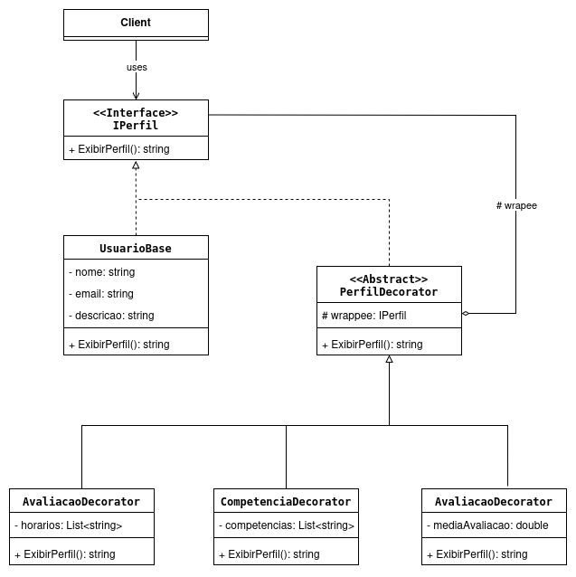

# GoF Estrutural – Decorator

## Introdução

O padrão Decorator é um padrão estrutural do *Gang of Four* (GoF) que "permite adicionar responsabilidades a um objeto dinamicamente. Os decoradores fornecem uma alternativa flexível ao uso de subclasses para extensão de funcionalidades" (GAMMA et al., 2000). Essencialmente, o padrão funciona "embrulhando" (wrapping) um objeto em outro objeto que contém as novas responsabilidades.

No contexto do **Monitor On**, o padrão foi utilizado para gerenciar a exibição do perfil de um `Usuario`. Um perfil de usuário pode ter diferentes "camadas" de informação:

  * Um `Aluno` (usuário-base) exibe apenas informações fundamentais (nome, descrição).
  * Um `Monitor` (usuário-base + decorações) exibe dinamicamente suas competências [(**UC4**)](https://unbarqdsw2025-2-turma01.github.io/2025.2-T01-G8_Sei-PossoEnsinar_Entrega_02/#/Modelagem/2.3.1.ModelagemCasosDeUso?id=uc4-gerenciar-compet%c3%aancias), sua média de avaliações [(**UC10**)](https://unbarqdsw2025-2-turma01.github.io/2025.2-T01-G8_Sei-PossoEnsinar_Entrega_02/#/Modelagem/2.3.1.ModelagemCasosDeUso?id=uc10-avaliar-sess%c3%b5es-conclu%c3%addas) e seus horários de disponibilidade [(**UC12**)](https://unbarqdsw2025-2-turma01.github.io/2025.2-T01-G8_Sei-PossoEnsinar_Entrega_02/#/Modelagem/2.3.1.ModelagemCasosDeUso?id=uc12-gerenciar-disponibilidade).

Essa abordagem nos permite "montar" um perfil com diferentes níveis de detalhe sem recorrer a uma hierarquia de herança complexa, aderindo ao princípio Aberto/Fechado (OCP).

## Metodologia

Para a aplicação deste padrão, seguimos as seguintes etapas:

1.  **Estudo do Padrão:** Revisão do padrão Decorator, suas vantagens e sua estrutura, utilizando as aulas da disciplina e fontes como *Refactoring Guru*.
2.  **Análise dos Casos de Uso:** Identificamos que a exibição do Perfil de Usuário era uma funcionalidade complexa e variável. Os casos de uso **UC4** (Gerenciar Competências), **UC10** (Avaliar Sessões) e **UC12** (Gerenciar Disponibilidade) representavam responsabilidades adicionais que poderiam ser "decoradas" em um perfil básico.
3.  **Modelagem e Adaptação:** Definimos a classe `UsuarioBase` como o componente concreto e criamos a interface `IPerfil` para ser o componente principal.
4.  **Elaboração do Diagrama:** O diagrama de classes do padrão foi modelado na ferramenta Draw.io, adaptado para o nosso contexto.
5.  **Implementação (C\#):** O código foi implementado em C\#, seguindo o diagrama e a arquitetura em camadas do projeto.
6.  **Elaboração do Documento:** Este documento foi consolidado para registrar todo o processo de decisão e implementação.

## Desenvolvimento

A aplicação do Decorator foi motivada pela necessidade de exibir diferentes "visões" de um `Usuario`. A alternativa, usando herança, seria criar uma classe `Monitor` que herda de `Usuario`. No entanto, isso traria rigidez: e se um Monitor ainda não tivesse avaliações? Ou se quiséssemos criar um "AlunoAvançado" que pode listar competências, mas não pode dar monitoria?

O Decorator resolve isso permitindo a **composição dinâmica**. Como o *Refactoring Guru* aponta, "você pode embrulhar um objeto em várias camadas de decoradores". Isso significa que nosso `UsuarioService` pode decidir em tempo de execução quais "camadas" de informação um perfil deve ter.

Para implementar o padrão, criamos:

1.  **`IPerfil` (Interface Component):** Uma interface comum que define o método `ExibirPerfil(): string`.
2.  **`UsuarioBase` (Concrete Component):** A classe-base que implementa `IPerfil` e exibe as informações fundamentais (nome, e-mail, descrição) do **UC3**.
3.  **`PerfilDecorator` (Abstract Decorator):** Uma classe abstrata que *implementa* `IPerfil` e *contém* (`has-a`) uma referência (`wrappee`) para outro `IPerfil`.
4.  **Decoradores Concretos:**
      * `CompetenciaDecorator` [(**UC4**)](https://unbarqdsw2025-2-turma01.github.io/2025.2-T01-G8_Sei-PossoEnsinar_Entrega_02/#/Modelagem/2.3.1.ModelagemCasosDeUso?id=uc4-gerenciar-compet%c3%aancias): Adiciona a lista de competências à exibição.
      * `AvaliacaoDecorator` [(**UC10**)](https://unbarqdsw2025-2-turma01.github.io/2025.2-T01-G8_Sei-PossoEnsinar_Entrega_02/#/Modelagem/2.3.1.ModelagemCasosDeUso?id=uc10-avaliar-sess%c3%b5es-conclu%c3%addas): Adiciona a média de avaliações à exibição.
      * `DisponibilidadeDecorator` [(**UC12**)](https://unbarqdsw2025-2-turma01.github.io/2025.2-T01-G8_Sei-PossoEnsinar_Entrega_02/#/Modelagem/2.3.1.ModelagemCasosDeUso?id=uc12-gerenciar-disponibilidade): Adiciona os horários de atendimento à exibição.

Na prática, o `UsuarioService` pode agora "montar" um perfil. Ele começa com um `UsuarioBase` e, dependendo das regras de negócio (se o usuário é monitor, se tem avaliações, etc.), ele "embrulha" o objeto base com os decoradores necessários. O resultado é um código limpo, flexível e alinhado com o princípio de "Composição sobre Herança".

-----

## Diagrama do GoF Decorator


<font size="2"><p style="text-align: center"><b>Figura 1:</b> Diagrama Estrutural Decorator.</p></font>

<div style="text-align: center;">



<font size="2"><p style="text-align: center"><b>Autor:</b> Atyrson Souto, 2025.</p></font>
</div>

## Código (C\#)

Abaixo estão os principais artefatos de código C\# que implementam o padrão.

### Interface IPerfil.cs (Component)

```
namespace SeiPossoEnsinar.Application.Interfaces
{
    public interface IPerfil
    {
        string ExibirPerfil();
    }
}
```

### Classe Concreta UsuarioBase.cs (Concrete Component)

```
using SeiPossoEnsinar.Application.Interfaces;
using SeiPossoEnsinar.Domain.Entities; // Assumindo que você tem a entidade

// Define o namespace (ex: SeiPossoEnsinar.Application.Services)
namespace SeiPossoEnsinar.Application.Services
{
    public class UsuarioBase : IPerfil
    {
        private readonly Usuario _usuario;

        public UsuarioBase(Usuario usuario)
        {
            _usuario = usuario;
        }

        public string ExibirPerfil()
        {
            // Exibição base (UC3)
            return $"<h1>{_usuario.Nome}</h1>\n" +
                   $"<p>{_usuario.Email}</p>\n" +
                   $"<p>{_usuario.Descricao ?? "Usuário não forneceu uma descrição."}</p>\n";
        }
    }
}
```

### Classe Abstrata PerfilDecorator.cs (Abstract Decorator)

```
using SeiPossoEnsinar.Application.Interfaces;

namespace SeiPossoEnsinar.Application.Decorators
{
    public abstract class PerfilDecorator : IPerfil
    {
        protected readonly IPerfil _wrappee;

        public PerfilDecorator(IPerfil wrappee)
        {
            _wrappee = wrappee;
        }

        public virtual string ExibirPerfil()
        {
            return _wrappee.ExibirPerfil();
        }
    }
}
```

### Decorador Concreto CompetenciaDecorator.cs

```
using SeiPossoEnsinar.Application.Interfaces;
using System.Collections.Generic;
using System.Text;

namespace SeiPossoEnsinar.Application.Decorators
{
    /// Adiciona a responsabilidade de exibir Competências (UC4).
    public class CompetenciaDecorator : PerfilDecorator
    {
        private readonly List<string> _competencias;

        public CompetenciaDecorator(IPerfil wrappee, List<string> competencias) : base(wrappee)
        {
            _competencias = competencias;
        }

        public override string ExibirPerfil()
        {
            string exibicaoBase = base.ExibirPerfil();

            var sb = new StringBuilder();
            sb.AppendLine("<h2>Competências (UC4):</h2>");
            sb.AppendLine("<ul>");
            foreach (var comp in _competencias)
            {
                sb.AppendLine($"  <li>{comp}</li>");
            }
            sb.AppendLine("</ul>");

            return exibicaoBase + sb.ToString();
        }
    }
}
```

### Decorador Concreto AvaliacaoDecorator.cs

```
using SeiPossoEnsinar.Application.Interfaces;

namespace SeiPossoEnsinar.Application.Decorators
{
    /// Adiciona a responsabilidade de exibir a Média de Avaliações (UC10).
    public class AvaliacaoDecorator : PerfilDecorator
    {
        private readonly double _mediaAvaliacao;

        public AvaliacaoDecorator(IPerfil wrappee, double mediaAvaliacao) : base(wrappee)
        {
            _mediaAvaliacao = mediaAvaliacao;
        }

        public override string ExibirPerfil()
        {
            string exibicaoBase = base.ExibirPerfil();

            string minhaAvaliacao = $"<h2>Média de Avaliações (UC10):</h2>\n" +
                                    $"<p> {_mediaAvaliacao:F1} de 5.0</p>\n";

            return exibicaoBase + minhaAvaliacao;
        }
    }
}
```

### UsuarioService.cs (Cliente - Como usar)

```
using SeiPossoEnsinar.Application.Interfaces;
using SeiPossoEnsinar.Application.Decorators;
using SeiPossoEnsinar.Domain.Entities;

namespace SeiPossoEnsinar.Application.Services
{
    public class UsuarioService
    {
        public string GetPerfilFormatado(int usuarioId)
        {
            Usuario usuario = new Usuario() {
                Nome = "Atyrson Souto (Monitor)",
                Email = "atyrson@email.com",
                Descricao = "Monitor de Arquitetura de Software."
            };

            var competencias = new List<string> { "C#", "UML", "GoF Patterns" };
            double mediaAvaliacao = 4.8;
            bool temAvaliacoes = true;

            IPerfil perfilExibicao = new UsuarioBase(usuario);

            // Regra de negócio (UC4): Se tiver competências, decora
            if (competencias.Count > 0)
            {
                perfilExibicao = new CompetenciaDecorator(perfilExibicao, competencias);
            }

            // Regra de negócio (UC10): Se tiver avaliações, decora
            if (temAvaliacoes)
            {
                perfilExibicao = new AvaliacaoDecorator(perfilExibicao, mediaAvaliacao);
            }

            return perfilExibicao.ExibirPerfil();
        }
    }
}
```

## Histórico de Versões

| Versão | Data | Descrição | Autor(es) | Revisor(es) |
| :--- | :--- | :--- | :--- | :--- |
| 1.0 | 22/10/2025 | Criação do documento, adição da introdução, metodologia e desenvolvimento. | Atyrson Souto | Yan Guimarães |
| 1.1 | 22/10/2025 | Adição do Diagrama | Atyrson Souto | Yan Guimarães |
| 1.2 | 24/10/2025 | 	Adição dos códigos em C# | Yan Guimarães |  |
