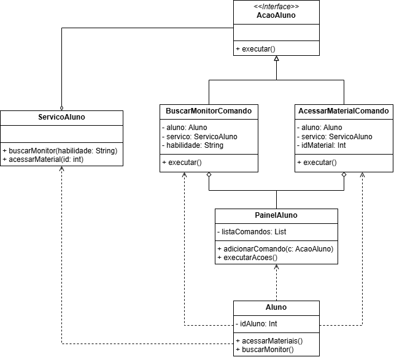

# 3.3.1. Command

## Introdução

Este documento detalha a aplicação do padrão de projeto Command (Comando) – um dos padrões Comportamentais do Gang of Four (GoF) – no sistema de gerenciamento de sessões de ensino. O objetivo central do padrão Command é encapsular uma chamada de método como um objeto. Essa técnica converte solicitações ou operações em objetos autocontidos, permitindo que as requisições sejam manipuladas de maneira flexível, suportando funcionalidades avançadas como a organização de filas de tarefas, o registro de histórico de ações (log) e a implementação de operações de desfazer (undo).

No contexto deste projeto, o padrão Command é implementado para formalizar e desacoplar as interações do Aluno com os serviços do sistema. Ao encapsular ações como "Buscar Monitor" ou "Acessar Material" em objetos de comando, o painel de controle do Aluno pode gerenciar e executar essas requisições de forma uniforme, sem a necessidade de conhecer a lógica de negócio subjacente.

-----

## Metodologia

A implementação do padrão Command foi realizada seguindo as melhores práticas de design orientado a objetos:

1. Mapeamento de Ações: Análise das interações primárias do Aluno com o sistema para identificar ações que poderiam ser tratadas de forma assíncrona ou enfileirada. As ações buscarMonitor e acessarMateriais foram escolhidas como Comandos Concretos.
2. Estrutura de Componentes: Definição dos quatro papéis essenciais do padrão:
3. Command: Interface AcaoAluno (o contrato).
4. Concrete Command: Classes BuscarMonitorComando e AcessarMonitorComando.
5. Receiver: Classe ServicoAluno (o executor da lógica).
6. Invoker: Classe PainelAluno (o disparador das ações).
7. Desenho UML: Criação do diagrama de classes (conforme a imagem fornecida) para visualizar o fluxo, enfatizando as relações de dependência e agregação (o PainelAluno agrega a AcaoAluno).

-----

## Desenvolvimento

O padrão Command foi aplicado para criar um mecanismo robusto e extensível para o Painel do Aluno, separando a intenção da ação da execução da ação.

**Estrutura do Encapsulamento de Ações**

O diagrama de classes ilustra como a requisição do Aluno é transformada em uma estrutura de objetos:

| Papel do Padrão | Entidade no Diagrama | Responsabilidade no Projeto |
| :--- | :--- | :--- | 
| Command (Interface) | <<Interface>> AcaoAluno | Contrato que define o método universal para iniciar qualquer ação: + executar(). | 
| Concrete Commands | BuscarMonitorComando, AcessarMonitorComando | Encapsulamento da Requisição: Cada classe empacota o Receptor (ServicoAluno), o Cliente (Aluno) e os parâmetros específicos. O método executar() simplesmente chama o método apropriado no Receptor, traduzindo o comando. | 
| Receiver (Receptor) | ServicoAluno | Lógica de Negócio: Contém o conhecimento e os métodos reais para realizar as operações de backend (+ buscarMonitor(habilidade: String), + acessarMaterial(id: int)). O Receptor é desacoplado do Invocador e dos Comandos. | 
| Invoker (Invocador) | PainelAluno | Gerenciamento do Comando: Contém a lista de comandos (listaComandos: List<AcaoAluno>) e o método genérico + executarAcoes(). O Invocador não sabe, e nem precisa saber, o que AcessarMonitorComando ou BuscarMonitorComando fazem; apenas sabe que pode chamá-los via executar(). | 
| Cliente | Aluno | Criação e Configuração: O Aluno é o componente que, a partir de suas próprias requisições (+ acessarMateriais(), + buscarMonitor()), cria as instâncias concretas dos Comandos e as passa para o PainelAluno (Invocador). | 

-----

### Diagrama

<b>Figura 1:</b> Diagrama de Classes do padrão Command

<b>Autor:</b> <a href="https://github.com/leanars">Bruno Cruz e Anne de Capdeville</a>, 2025

-----

## Histórico de Versões

| Versão | Data | Descrição | Autor(es) | Revisor(es) |
| :--- | :--- | :--- | :--- | :--- |
| 1.0 | 24/10/2025 | Criação da documentação | Anne de Capdeville | Bruno Cruz|
| 1.1 | 24/10/2025 | Documentação e criação do diagrama  | Anne de Capdeville e Bruno Cruz | Bruno Cruz |
