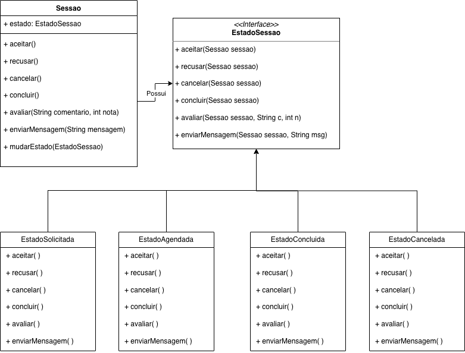

# 3.3.4. State

## Introdução

Com o objetivo de criar uma plataforma de monitoria acadêmica robusta e de fácil manutenção, o sistema **Sei&PossoEnsinar** está sendo desenvolvido utilizando boas práticas de arquitetura de software e padrões de projeto GoF (Gang of Four). Dentre eles, destaca-se o uso do padrão comportamental **State** para a gestão do ciclo de vida das sessões de monitoria.

A aplicação do padrão State surgiu da necessidade de encapsular os diferentes comportamentos de uma `Sessao` com base em seu estado atual — como `Solicitada`, `Agendada`, `Concluida` ou `Cancelada`. Isso permitiu que a entidade `Sessao` se mantivesse limpa, livre de condicionais complexas (`if`/`switch`), e facilitou a manutenção e futuras extensões do fluxo de agendamento.

## Metodologia

A metodologia adotada para a implementação do padrão **GoF State** seguiu uma abordagem orientada a objetos, alinhada a uma arquitetura em camadas e baseada nos princípios SOLID, especialmente:

* **Single Responsibility Principle (SRP)**: Cada classe de estado (ex: `EstadoSolicitada`) tem uma única responsabilidade: gerenciar o comportamento da sessão *naquele* estado específico.
* **Open/Closed Principle (OCP)**: O sistema é aberto para extensão (novos estados, como `EstadoEmRemarcacao`, podem ser adicionados) mas fechado para modificação (não é preciso alterar a classe `Sessao` ou os estados existentes para adicionar um novo).

### 1. Análise do Domínio

No contexto do **Sei&PossoEnsinar**, identificamos que uma `Sessao` passa por diferentes estados em seu ciclo de vida. Essas transições e regras de negócio foram levantadas a partir da [Modelagem de Casos de Uso](https://unbarqdsw2025-2-turma01.github.io/2025.2-T01-G8_Sei-PossoEnsinar_Entrega_02/#/Modelagem/2.3.1.ModelagemCasosDeUso) do sistema.

Os estados principais do ciclo de vida da `Sessao` são:

* **Solicitada**: (Originada de UC6 - Solicitar Sessão) O `Aluno` requisitou a sessão, que aguarda a aprovação do `Monitor`.
* **Agendada**: (Originada de UC13 - Atender Solicitações e UC7 - Definir Horário) O `Monitor` aceitou a solicitação.
* **Concluida**: A sessão de monitoria ocorreu (estado final do fluxo principal).
* **Cancelada**: A sessão foi recusada (UC13) ou cancelada por uma das partes.

Cada estado apresenta regras de negócio distintas para as ações possíveis, que se relacionam diretamente com os Casos de Uso:

* **`aceitar()` / `recusar()`**: Correspondem ao **UC13 - Atender Solicitações**.
* **`cancelar()`**: Ação de usuário (Aluno/Monitor) não especificada em uma UC, mas necessária ao fluxo.
* **`concluir()`**: Ação do Monitor/Sistema para finalizar a sessão.
* **`enviarMensagem()`**: Corresponde ao **UC8 - Tirar Dúvidas**.
* **`avaliar()`**: Corresponde ao **UC10 - Avaliar Sessões Concluídas**.

Por exemplo:
* A ação `avaliar()` (UC10) só é permitida no estado `Concluida`.
* A ação `aceitar()` (UC13) só é permitida no estado `Solicitada`.
* A ação `enviarMensagem()` (UC8) só é permitida no estado `Agendada`.

Essa variação de comportamento com base no estado é a indicação clássica para a aplicação do padrão **State**, evitando que a entidade `Sessao` acumule essa lógica condicional.

### 2. Modelagem do Padrão State

O padrão **State** foi modelado com três componentes centrais:

#### a) Interface `EstadoSessao`
Define um contrato comum para todas as ações cujo comportamento varia conforme o estado da sessão. Os métodos recebem o Contexto (`Sessao`) como parâmetro para permitir que os estados controlem a transição:
* `aceitar(Sessao sessao)`
* `recusar(Sessao sessao)`
* `cancelar(Sessao sessao)`
* `concluir(Sessao sessao)`
* `avaliar(Sessao sessao, ...)`
* `enviarMensagem(Sessao sessao, ...)`

#### b) Classes Concretas de Estado
Implementações específicas da interface `EstadoSessao` para cada estado:
* `EstadoSolicitada`
* `EstadoAgendada`
* `EstadoConcluida`
* `EstadoCancelada`

Cada classe encapsula sua própria lógica. Por exemplo, o método `aceitar()` em `EstadoSolicitada` executará a lógica de agendamento e mudará o estado da sessão para `EstadoAgendada`, enquanto o mesmo método em `EstadoAgendada` lançará uma exceção, pois a ação é inválida.

#### c) Classe Contexto: `Sessao`
É a entidade principal do domínio. Ela armazena a referência ao seu estado atual (via interface `EstadoSessao`) e delega todas as chamadas de ação para o objeto de estado. A `Sessao` não sabe *qual* estado concreto está ativo, apenas que ele implementa o contrato.

### 3. Decisões de Projeto

* **Separação entre estado e lógica de negócio**: A entidade `Sessao` (Contexto) não precisa saber "como" cada estado funciona — apenas delegar a chamada.
* **Flexibilidade para extensão futura**: Novos estados (ex: "Aguardando Pagamento") podem ser adicionados sem alterar o código existente.
* **Mudança dinâmica de comportamento**: O estado é trocado em tempo de execução pelos próprios objetos de estado, através do método `mudarEstado()` do Contexto.

### 4. Integração com a Arquitetura em Camadas

* **Camada de Domínio**: Residem a entidade `Sessao`, a interface `EstadoSessao` e os estados concretos.
* **Camada de Aplicação**: O `SessaoService` (serviço de aplicação) orquestra as ações. Ele carrega a entidade `Sessao` do repositório, chama o método de ação (ex: `sessao.aceitar()`), e o padrão State cuida da lógica interna. O serviço não conhece os estados concretos.
* **Camada de Infraestrutura**: O Repositório persiste a `Sessao`. Para salvar o estado, é comum usar um `enum` (ex: `StatusSessao`) no banco. Ao carregar a `Sessao`, o repositório instancia o objeto de estado concreto correspondente ao `enum` salvo.

## Diagrama do GoF State

<b>Autor:</b> Yan Guimarães, 2025.

## Código (Implementação em C#)

A seguir está a estrutura de código em C# (.NET) que implementa o padrão State, seguindo a arquitetura em camadas (Domínio, Aplicação, Apresentação).

## Conclusão

O padrão **State** mostra-se uma ferramenta fundamental no projeto **Sei&PossoEnsinar** para gerenciar o complexo ciclo de vida das sessões de monitoria. Ao isolar o comportamento específico de cada estado em classes independentes, alinhadas aos princípios SOLID, conseguimos:

* **Reduzir drasticamente** o uso de condicionais (`if`/`switch`) na entidade `Sessao`.
* **Melhorar a organização** e coesão do código, tornando-o mais limpo.
* **Facilitar a extensão** futura com novos estados, sem impacto no código existente.
* **Garantir baixo acoplamento** entre a entidade `Sessao` (Contexto) e as regras de negócio de seus estados.

## Bibliografia
> State - Padrão Comportamental. Refactoring Guru. Disponível em: https://refactoring.guru/design-patterns/state. Acesso em: 15 out. 2025.

> SERRANO, Milene. 10d - Video-Aula - DSW - GoFs - Comportamentais - Demais Padrões - Visões. 1 vídeo (aula de Arquitetura e Desenho de Software). Disponível em: [Link da aula da professora]. Acesso em: 15 out. 2025.

> State Design Pattern. SourceMaking. Disponível em: https://sourcemaking.com/design_patterns/state. Acesso em: 16 out. 2025.

## Histórico de Versões

| Versão | Data | Descrição | Autor(es) | Revisor(es) |
| :---: | :---: | :--- | :--- | :--- |
| 1.0 | 23/10/2025 | Criação do documento, introdução e modelagem do Gof State. | Yan Lucas Guimarães | Atyrson Souto, Pedro Tulio |
| 1.1 | 23/10/2025 | Adição do Diagrama UML e Conclusão. | Yan Lucas Guimarães | Victor Camara, Bruno Cruz |
| 1.2 | 24/10/2025 | Vinculação da Análise de Domínio com os Casos de Uso (UCs). | Yan Lucas Guimarães | |
