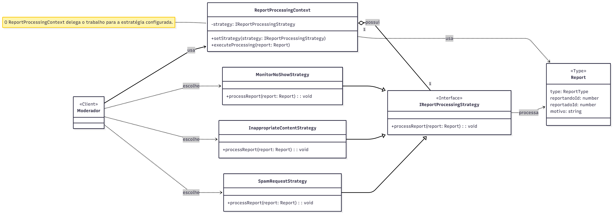

# 3.3.5. Padrão de Projeto Strategy

## Introdução

Este documento apresenta a aplicação do padrão de projeto **Strategy** no desenvolvimento do **Sei&PossoEnsinar**.

O padrão **Strategy**, classificado como um padrão comportamental pelo *Gang of Four (GoF)*, permite definir uma família de algoritmos, encapsular cada um deles e torná-los intercambiáveis (Refactoring Guru, 2024). Essa abordagem possibilita que o algoritmo varie independentemente dos clientes que o utilizam, promovendo flexibilidade e a capacidade de alterar o comportamento de um objeto em tempo de execução.

---

## Metodologia

Para o desenvolvimento do trabalho, foram realizadas as seguintes etapas:

1. **Estudo do conteúdo:** foi estudado o conteúdo disponível no Aprender 3, complementada por pesquisas adicionais para aprofundamento no tema.
2. **Análise dos Casos de Uso:** após a compreensão do conteúdo, foi analisado onde o padrão Strategy poderia ser aplicado no contexto do *Sei&PossoEnsinar*.
3. **Elaboração do diagrama:** o diagrama referente ao padrão Strategy foi criado utilizando a plataforma **Mermaid**.
4. **Elaboração do documento:** o texto foi redigido e aprimorado ao longo das etapas, consolidando o processo.

---

## Desenvolvimento

Ao analisar os casos de uso, identificou-se que uma funcionalidade essencial do **Sei&PossoEnsinar** é a moderação, permitindo que usuários reportem problemas.
Para cada tipo de reporte, diferentes medidas precisam ser adotadas, a lógica para tratar um monitor que não compareceu difere daquela necessária para lidar com conteúdo inapropriado no chat, que, por sua vez, também se distingue do tratamento para um aluno enviando spam de solicitações.

Concentrar todas essas variações em um único serviço, utilizando múltiplos *if/else*, resultaria em código complexo e difícil de manter.
Para mitigar esse problema, a adoção do **padrão Strategy** foi a solução ideal.

O padrão Strategy permite definir uma família de algoritmos (as diferentes lógicas de processamento de reportes), encapsular cada um deles em classes separadas e torná-los intercambiáveis.
Assim, em vez de um código monolítico, o componente responsável pelo processamento mantém uma referência para uma interface comum e delega a execução para a estratégia adequada.

Esse mecanismo promove um código mais limpo, coeso e desacoplado, facilitando a adição de novos tipos de denúncias ou a modificação de regras existentes sem impactar o código principal.

---

## Diagrama

**Figura 1:** Diagrama de Classes que ilustra a aplicação do padrão Strategy no *Sei&PossoEnsinar*.




---

## Estrutura e Componentes

* **Client (Moderador):** Representa o usuário ou sistema que aciona o processamento dos reportes.
* **ReportProcessingContext:** Classe responsável por manter uma referência à interface `IReportProcessingStrategy` e delegar o processamento.
* **IReportProcessingStrategy:** Interface (Strategy) que define o contrato comum para todas as estratégias.
* **MonitorNoShowStrategy**, **InappropriateContentStrategy** e **SpamRequestStrategy:** Classes concretas (Concrete Strategies) que implementam a interface, cada uma com sua própria lógica de processamento.

---

## Código

### 1. Tipos (`report.type.ts`)

```typescript
// Define os tipos de reportes aceitos
export type ReportType = 'no-show' | 'inappropriate' | 'spam';

// Estrutura do objeto Report
export type Report = {
  type: ReportType;
  reportandoId: number; // ID de quem reporta
  reportadoId: number;  // ID de quem foi reportado
  motivo: string;
};
```

---

### 2. Interface Strategy (`report-strategy.interface.ts`)

```typescript
import { Report } from '../types/report.type';

// Interface Strategy
export interface IReportProcessingStrategy {
  processReport(report: Report): void;
}
```

---

### 3. Estratégias Concretas

#### `monitor-no-show.strategy.ts`

```typescript
import { IReportProcessingStrategy } from './report-strategy.interface';
import { Report } from '../types/report.type';

export class MonitorNoShowStrategy implements IReportProcessingStrategy {
  processReport(report: Report): void {
    console.log(`[MonitorNoShowStrategy] Processando reporte: Aluno ${report.reportandoId} reportou Monitor ${report.reportadoId} por não comparecer.`);
    // Lógica:
    // 1. Verifica sessão agendada
    // 2. Aplica advertência ao monitor
  }
}
```

#### `inappropriate-content.strategy.ts`

```typescript
import { IReportProcessingStrategy } from './report-strategy.interface';
import { Report } from '../types/report.type';

export class InappropriateContentStrategy implements IReportProcessingStrategy {
  processReport(report: Report): void {
    console.log(`[InappropriateContentStrategy] Processando reporte de conteúdo inapropriado do usuário ${report.reportadoId}.`);
    // Lógica:
    // 1. Analisa o log do chat ou material
    // 2. Suspende o usuário reportado
  }
}
```

#### `spam-request.strategy.ts`

```typescript
import { IReportProcessingStrategy } from './report-strategy.interface';
import { Report } from '../types/report.type';

export class SpamRequestStrategy implements IReportProcessingStrategy {
  processReport(report: Report): void {
    console.log(`[SpamRequestStrategy] Processando reporte de spam do Aluno ${report.reportadoId}.`);
    // Lógica:
    // 1. Verifica número de solicitações
    // 2. Aplica suspensão temporária ou "rate limit"
  }
}
```

---

### 4. Contexto (`report-processing-context.service.ts`)

```typescript
import { Injectable } from '@nestjs/common';
import { Report } from './types/report.type';
import { IReportProcessingStrategy } from './strategies/report-strategy.interface';

@Injectable()
export class ReportProcessingContext {
  private strategy: IReportProcessingStrategy;

  setStrategy(strategy: IReportProcessingStrategy) {
    this.strategy = strategy;
  }

  executeProcessing(report: Report) {
    if (!this.strategy) {
      throw new Error('Nenhuma estratégia de processamento foi definida.');
    }
    this.strategy.processReport(report);
  }
}
```

---

### 5. Controller — O Cliente (`report.controller.ts`)

```typescript
import { Body, Controller, Post, BadRequestException } from '@nestjs/common';
import { ReportProcessingContext } from './report-processing-context.service';
import { Report } from './types/report.type';

// Estratégias concretas
import { MonitorNoShowStrategy } from './strategies/monitor-no-show.strategy';
import { InappropriateContentStrategy } from './strategies/inappropriate-content.strategy';
import { SpamRequestStrategy } from './strategies/spam-request.strategy';

@Controller('report')
export class ReportController {
  constructor(private readonly reportContext: ReportProcessingContext) {}

  @Post()
  handleReport(@Body() report: Report) {
    switch (report.type) {
      case 'no-show':
        this.reportContext.setStrategy(new MonitorNoShowStrategy());
        break;
      case 'inappropriate':
        this.reportContext.setStrategy(new InappropriateContentStrategy());
        break;
      case 'spam':
        this.reportContext.setStrategy(new SpamRequestStrategy());
        break;
      default:
        throw new BadRequestException(`Tipo de reporte não suportado: ${report.type}`);
    }

    this.reportContext.executeProcessing(report);
    return { message: 'Reporte processado com sucesso.' };
  }
}
```

---

### 6. Módulo (`report.module.ts`)

```typescript
import { Module } from '@nestjs/common';
import { ReportProcessingContext } from './report-processing-context.service';
import { ReportController } from './report.controller';

@Module({
  providers: [ReportProcessingContext],
  controllers: [ReportController],
})
export class ReportModule {}
```

---

## Demonstração do Código sendo Executado

**Execução:**
Participantes: Pedro Camilo e João Victor

**Link do vídeo:** [vídeo no youtube](https://youtu.be/vTQFWbouPW4)

---

## Conclusão

A adoção do padrão **Strategy** no *Sei&PossoEnsinar* proporcionou uma solução elegante para o tratamento de diferentes tipos de reportes de usuários, como *não comparecimento*, *spam* ou *conteúdo inadequado*.

Ao encapsular cada lógica de processamento em uma estratégia específica, o sistema tornou-se mais modular, facilitando a manutenção, os testes e a extensão de novas funcionalidades.
Dessa forma, foi possível eliminar estruturas condicionais complexas no serviço de moderação, promovendo um código mais limpo, coeso e alinhado com boas práticas de design orientado a objetos.

---

## Bibliografia

* GAMMA, Erich; HELM, Richard; JOHNSON, Ralph; VLISSIDES, John. *Design Patterns: Elements of Reusable Object-Oriented Software.* Addison-Wesley, 1994.
* REFACTORING GURU. *Strategy design pattern.* Disponível em: [https://refactoring.guru/design-patterns/strategy](https://refactoring.guru/design-patterns/strategy). Acesso em: 23 de outubro 2025.

---

## Histórico de Versões

| Versão  | Data       | Descrição                                                | Autor(es)          | Revisor(es)        |
| ------- | ---------- | -------------------------------------------------------- | ------------------ | ------------------ |
| **1.0** | 23/10/2025 | Criação do documento | [Pedro Camilo]() [João Victor]() |            |
| **1.1** | 23/10/2025 | Geração do diagrama e código específico do projeto.      |       [Pedro Camilo]() [João Victor]()       |  |
